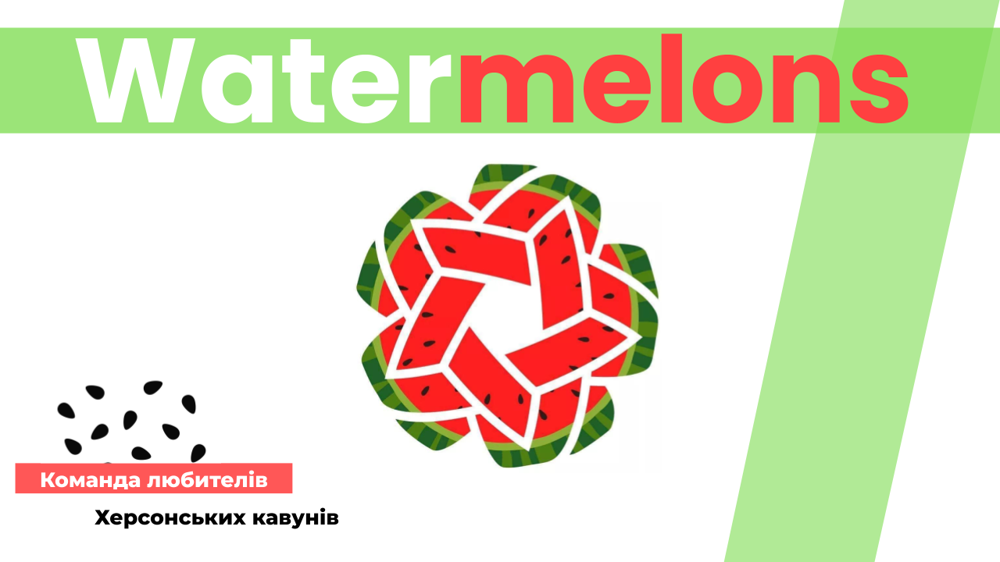

## Command project - Watermelons - (React) [Presentation](https://docs.google.com/presentation/d/1Bbjm9zPtEjoapBqBCjl8oLfS_AVQy5Uc/edit#slide=id.p1).

.png>)
.png>)
.png>)
.png>)
.png>)
.png>)

## Links

- [site](https://nikolaylemehov.github.io/slimmom/)
- [repository](https://github.com/NikolayLemehov/slimmom)
